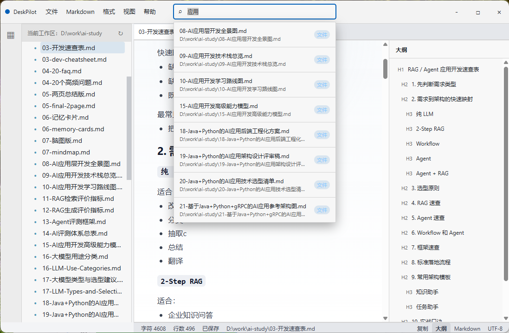

# DeskPilot

DeskPilot 是一个简单的 Markdown 编辑器。

## 截图

## 待办列表

- [x] 编辑 Markdown
- [x] 编辑其它类型文本
- [ ] 所有菜单功能实现
- [ ] 增强全文检索（RetrievalBoost）
- [ ] 增加 AI 助手窗口
- [ ] 调用本地 Ollama
- [ ] 调用远程大模型
- [ ] 增加向量搜索
- [ ] 增加内容自动摘要
- [ ] 增加自动关联分析
- [ ] 搭建本地知识库（待定）

## 联系方式

doveyh@foxmail.com

## 许可证

本项目采用 Apache License 2.0 许可证。
详见 [LICENSE](./LICENSE)。
